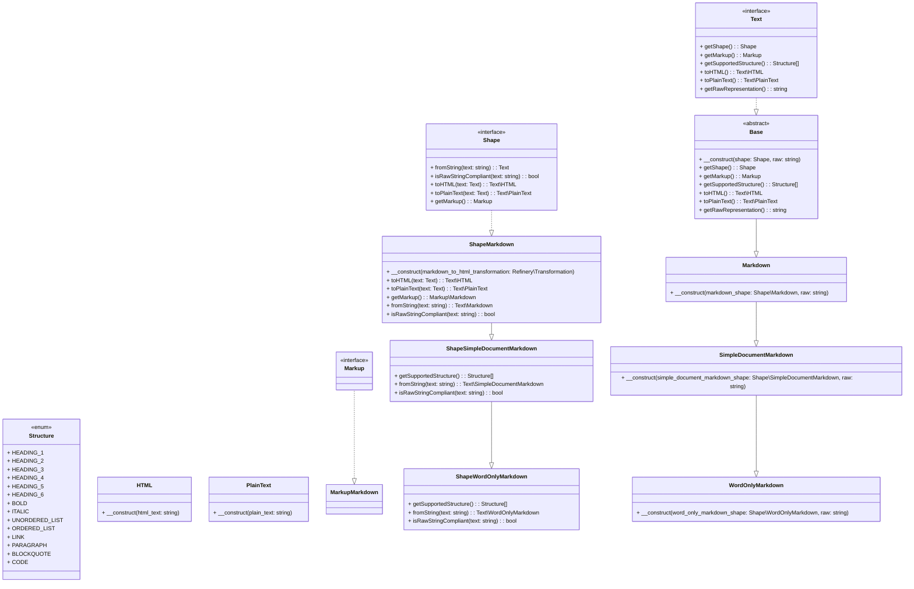

# Text Handling in ILIAS

For a detailed explanation look into the [according paper](../../../../../docs/development/text-handling.md).

This implementation currently focusses on the Markdown classes to make the proposal
in the paper accessible as code. This is missing implementations for HTML and PlainText
(and, possibly, other formats).

This simplified class diagram, which omits associations, aggregations, and compositions
for clarity, might help to understand the code.

